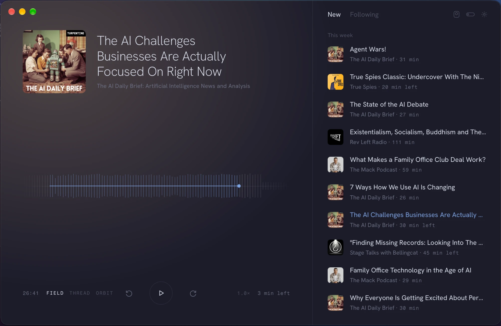
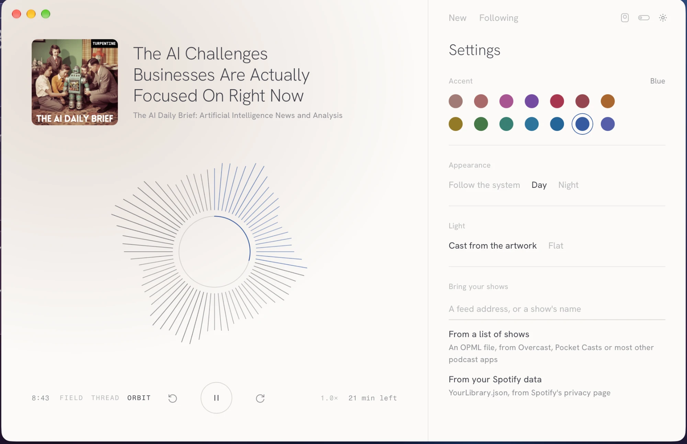
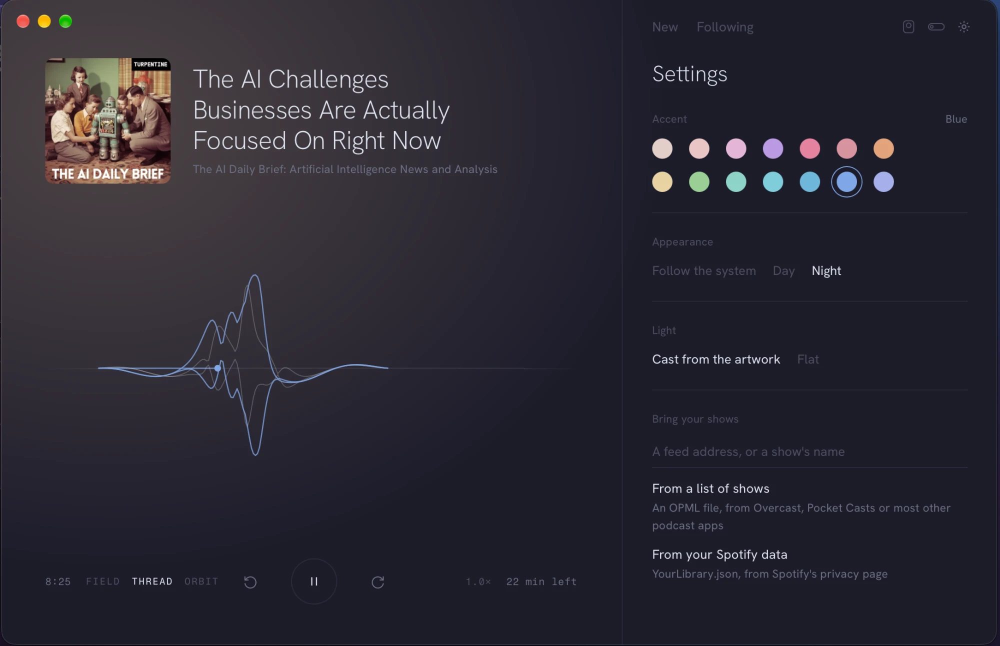
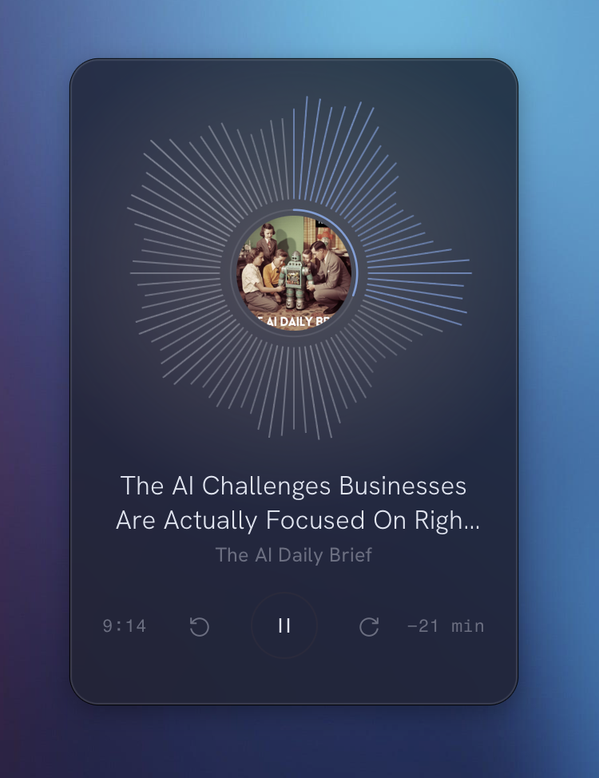
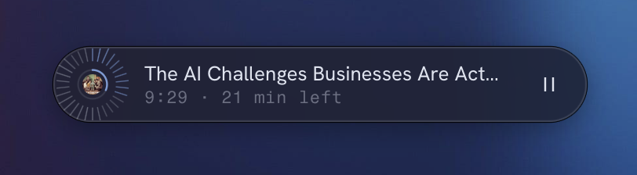
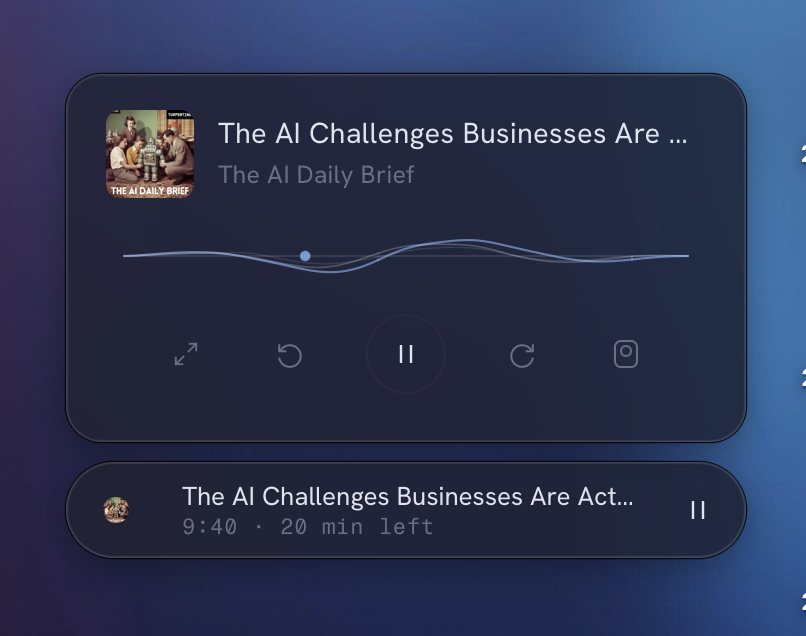
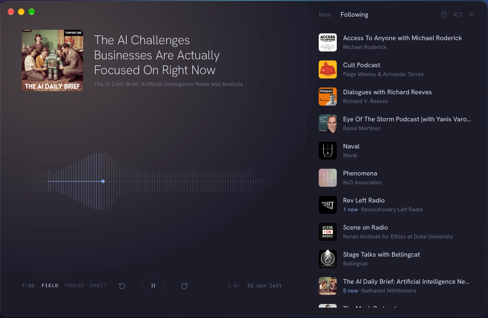

# Zenpod

A quiet podcast player for macOS.



Each episode appears as a single shape drawn from its loudness, so you can see where it gets busy before you play it. Click the shape to jump to that point.

## Three ways to see an episode

| Orbit | Thread |
| --- | --- |
|  |  |

Field is the third, shown at the top. Chapters sit on the shape, and the played part takes your accent colour.

## Out of the way

The Mini and the Pill float above other windows. They never take focus from the app you're working in. Drag them from anywhere that isn't a button.

<table>
  <tr>
    <td></td>
    <td>
      <br><br>
      
    </td>
  </tr>
</table>

## What it does

- Follows shows by feed address or by name, and checks them hourly.
- Imports your shows from an OPML file (Overcast, Pocket Casts and most other apps) or from your Spotify data export.
- Shows chapters and transcripts when the feed has them.
- Keeps episodes for offline listening.
- Day, Night or follow the system, with fourteen accent colours. The window light can take its colour from the show's artwork.



## Build

Needs macOS 13 or later, Rust, Node and pnpm.

```bash
pnpm install
pnpm tauri build
```

The app and DMG land in `src-tauri/target/release/bundle/`. The build is signed ad hoc, not notarised, so the first time you open it, right-click the app and choose Open.

For development:

```bash
pnpm tauri dev
```

Built with Tauri 2 and SvelteKit.
