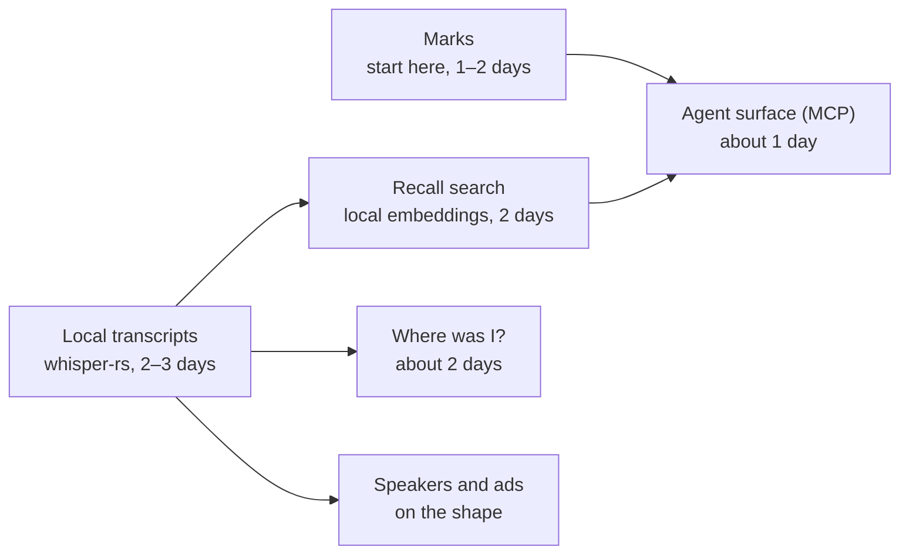

# Zenpod: ideas for future upgrades

Claude · 27 September 2026

These are Claude's ideas for Zenpod's future upgrades, written as GenZen's lead product designer for the day. They are proposals, not an approved build plan. Today Zenpod lets you see an episode's shape. Next, it should let you keep what you heard.

Most podcast apps stop at playback. Snipd already offers highlights, transcript search and note export, so the features alone are not new. Zenpod's edge is doing it quietly, locally and on the episode's shape. That is where Zenpod can go next, without giving up being local-first, quiet and free of accounts.

## Five big bets, ranked

| # | Idea | What it is | Why it matters | Time (Claude building) |
| --- | --- | --- | --- | --- |
| 1 | Marks (the Margin) | One key, or a click on the shape, drops a mark. It shows as an open circle on Field, Thread or Orbit, like a chapter node. Each mark keeps the timestamp, the 30 seconds around it and an optional note. Marks export to the vault as markdown. | The feature Zenpod becomes known for. It fits the core idea: your marks sit on the episode's shape. | 1–2 days for v1 |
| 2 | Recall | Local transcripts through `whisper-rs`, labelled as Zenpod's, never as the feed's. Local embeddings (gte-small, as the vault uses) answer questions like "where did someone talk about agency pricing?" and open the episode at that point. | Search across everything you've heard, with nothing leaving the Mac. It unlocks bets 3 and 5 and most of the smaller ideas. | 2–3 days for transcripts, then 2 for search |
| 3 | Where was I? | Rewind to the start of the current thought, not a flat 15 seconds. Two quiet lines on what you missed after you drift. Resume with a sentence: "You stopped as they turned to hiring." Generated chapters for episodes without them, labelled as Zenpod's. | Treats wandering attention as the normal case, which is GenZen's neurodivergent (ND) work applied to listening. No mainstream player does this. | About 2 days, after transcripts |
| 4 | Anything becomes an episode | A private feed on the Shelf: articles, newsletters, vault notes and Steve's morning brief, read aloud by local Kokoro TTS, built on `<zen-audio-reader>`. | Zenpod becomes the one place you listen to anything, and those items get shapes, marks and recall like any episode. | 2–3 days |
| 5 | Zenpod as an agent surface | A small read-only MCP server over the SQLite library. Steve can answer "what did I mark this week?", "play the part about X" or "queue 40 minutes on strategy." | Connects Zenpod to Intelizen and the rest of GenZen OS with no account and no server. | About 1 day |

## Smaller ideas for the shape

Each of these adds meaning to the Field, Thread and Orbit. Most depend on transcripts from Recall.

- **Speakers:** colour bands on the Field showing who's talking, from diarization.
- **Ads:** drawn as dashed spans on the shape, and playback skips over them.
- **Fits the time:** "I have 35 minutes" builds a queue that fills the walk, using the durations Zenpod already knows.
- **Share a moment:** a clip card with the shape of that segment, the quote and the audio. This only matters if Zenpod goes public.

## If Zenpod becomes a product

These only matter on Path B from `NEXT.md`, and they come after signing and notarising.

- **iPhone and CarPlay:** a phone app synced through iCloud (CloudKit), so there are still no accounts. This decision shapes the data layer, so make it early rather than rebuild later.
- **Listen together:** two Macs play in sync, peer to peer, with shared marks.

## Where to start

Start with Marks. It's the smallest bet, needs no transcripts, and turns Zenpod from a player into something that keeps what you heard. Transcripts come second, because they unlock Recall, Where was I? and the richer shape.

The agent surface is most useful once there are marks and transcripts to query. Anything becomes an episode depends on nothing else and can come at any point.

## Context

Keel's separate exploration is in [FUTURE-ENHANCEMENTS-KEEL.md](FUTURE-ENHANCEMENTS-KEEL.md). The two overlap on saved moments as the first bet, transcripts as the dependency, and mobile as a later decision.
